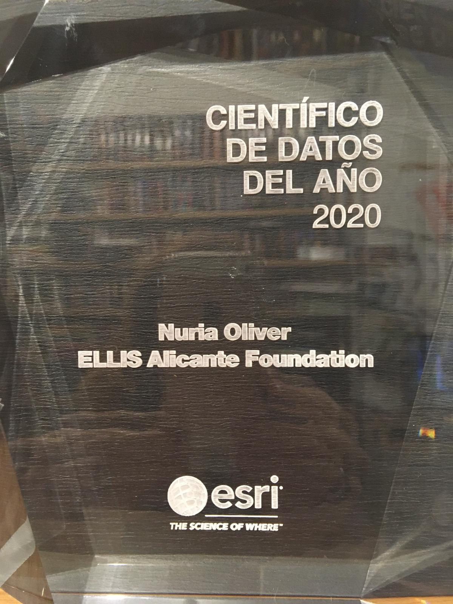

La Directora Científica de la Unidad ELLIS Alicante, Dr. Nuria Oliver, ha sido galardonada por [Esri](https://www.esri.com/en-us/home) como científica del año 2020 por su trabajo liderando el equipo de [Ciencias de Datos en la lucha contra COVID-19](https://ellisalicante.org/ai4covid19). 

<!--more-->

### Nuria Oliver, Científica de Datos del Año 2020 por ESRI

[Esri](https://www.esri.es/es-es/acerca-de/sobre-esri/quienes-somos), la empresa orientada al desarrollo de soluciones y servicios en el marco de los Sistemas de Información Geográfica (SIG), ha reconocido el trabajo del equipo de [Ciencias de Datos en la lucha contra COVID-19](https://ellisalicante.org/ai4covid19) con el premio Científico de Datos del Año 2020 por su trabajo con la gran encuesta ciudadana [covid19impactsurvey](https://ellisalicante.org/es/covid19impactsurvey y por sus análisis y visualizaciones de la  en el contexto de la pandemia de SARS-CoV-2.  

