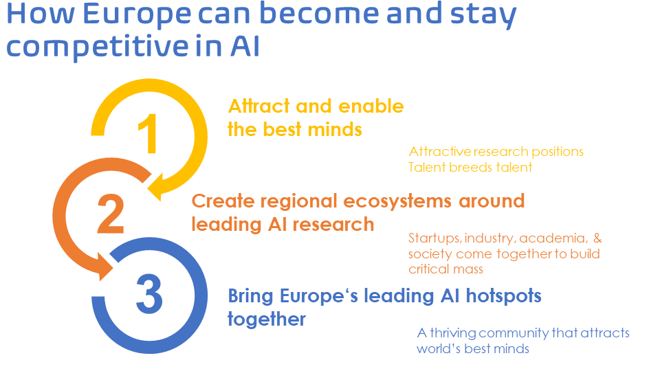

### **ELLIS**: **The European Laboratory for Learning and Intelligent Systems**

The European scientific community of researchers in modern Artificial Intelligence mobilized and created in 2018 a non-profit Association called [ELLIS](https://ellis.eu), the European Laboratory of Learning and Intelligent Systems. In December 2019 and after a competitive selection process, ELLIS announced the establishment of the first 17 ELLIS units in 10 countries in Europe and Israel. At that time the ELLIS network emerged with a commitment of more than 200 million euros of investment in research in the next 5 years. In June 2020, ELLIS announced the creation of 13 more ELLIS units, leading to a network of 30 units in 14 European countries and Israel. The [official inauguration](https://ellis.eu/events/ellis-units-official-launch) of these first 30 ELLIS units took place on September, 15th 2020. 

The [ELLIS Unit in Alicante](https://ellis.eu/units/alicante) was one of the first 17 units selected by ELLIS via a competitive review process by an international committee of experts. 

#### **The goals of ELLIS**

Attract, retain and cultivate the next generation of research talent in Europe. For this, it is necessary to address the main existing barriers, including the lack of competitive wages; the high teaching load; the rigidity of many academic environments in Europe that hinder the creation of startups and / or close collaboration with companies, and the fragmentation of research, generating islands of excellence and missing opportunities.

{:width="100%"}

### **ELLIS Alicante: The Institute for Humanity-centric Artificial Intelligence** 

The ELLIS Unit in Alicante is called "The Institute for Humanity-centric Artificial Intelligence". Formally, it is a non-profit private foundation, created by the generosity of 38 private donors. 

Its governing structures include the Board, a Scientific Advisory Committee and a Trustees Committee. 

It is devoted to carrying out research in three areas: 

(1) Individual and aggregate human behavior modeling from data using machine learning techniques, including exploring the opportunities in the context of the 17 Sustainable Development Goals. 

(2) The development of intelligent, interactive systems, with a focus on intelligent mobile systems and personal assistants. 

(3) Addressing the risks and limitations of today's data-driven, machine learning-based models used to assist in decision-making processes. Such limitations include the computational violation of privacy, the lack of veracity, algorithmic discrimination and opacity and the subliminal manipulation of human behavior. 

