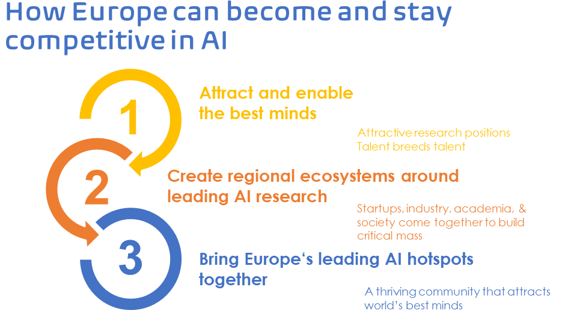

La comunidad científica de investigadore/as en Inteligencia Artificial (IA) en Europa se movilizó y creó en 2018 una Asociación sin ánimo de lucro llamada [ELLIS](https://ellis.eu), the European Laboratory of Learning and Intelligent Systems. En diciembre de 2019 y tras un proceso competitivo de selección, ELLIS anunció el establecimiento de 17 unidades ELLIS en 10 países de Europa e Israel. En ese momento surgía la red ELLIS con un compromiso de más de 200 millones de euros de inversión en investigación en los próximos 5 años. En junio de 2020, ELLIS anunció la creación de otras 13 unidades ELLIS más, dando lugar a una red de 30 unidades en 14 países europeos e Israel.

### Objetivos de ELLIS

Atraer, retener y cultivar la próxima generación de talento investigador excelente a Europa. Para ello, es necesario abordar las principales barreras existentes, incluyendo la falta de salarios competitivos; la alta carga docente; la rigidez de muchos entornos académicos europeos que dificultan la creación de startups y/o la colaboración estrecha con empresas, y la fragmentación de la investigación, generando islas de excelencia y perdiendo oportunidades. 

{:width="100%"}