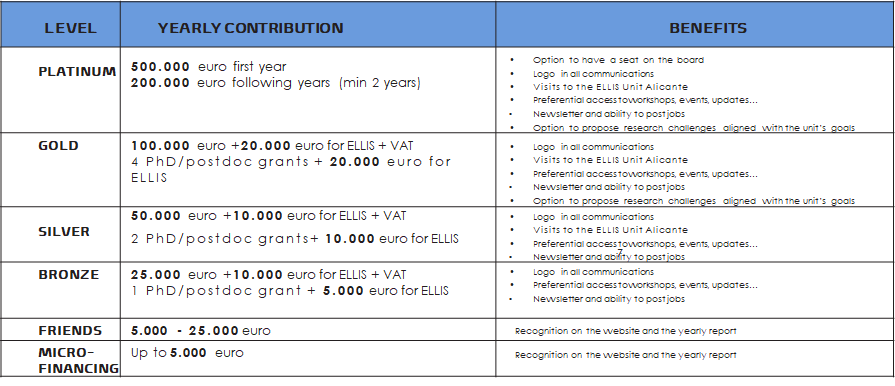

In order to fund the activities of the ELLIS Alicante Foundation, there are different sponsorship contributions and donations from companies and other institutions at various levels, aligned with the sponsorship program at [ELLIS](https://ellis.eu/sponsorship).

The table below summarizes the different sponsorship options at ELLIS Alicante. 

All the sponsorship levels will receive invitations to events organized by the ELLIS Alicante Foundation and to its inauguration event. Everyone will receive a distinctive pin and will be recognized in the Foundation’s annual report, in addition to an explicit acknowledgement according to their level of sponsorship.

Every sponsorship level will qualify to receive attractive fiscal benefits given that they are donations to a non-profit Foundation devoted to scientific research.