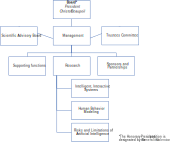

## **Gobernanza**

El **patronato** es responsable del gobierno y representación de la Fundación, el cumplimiento de sus objetivos y la administración y gestión de sus activos.. 

Además, la Fundación ELLIS Alicante cuenta con un Consejo Científico Asesor y un *Trustees Committee* . 

El **Consejo Científico Asesor ** está compuesto por científico/as de reconocido prestigio internacional en las áreas de investigación de la Fundación ELLIS Alicante. Su función es apoyar la agenda de investigación de la Fundación ELLIS Alicante y aportar su opinión experta. Normalmente, se reúne una vez al año. 

El **Trustees Committee** está integrado por personas de gran relevancia desde el punto de vista institucional, político, profesional, empresarial o social. Actúan como embajadores de la Fundación ELLIS Alicante con un enfoque particular en ayudar a la Fundación a identificar nuevas oportunidades de financiación y colaboración. 

Finalmente, el patronato podrá nombrar un director/a de la Fundación, con funciones ejecutivas. El director/a será responsable de la implementación de la visión y misión de la Fundación. Dependiendo del perfil, el director/a también podría estar a cargo del liderazgo científico de la Fundación o el podría nombrar un director/a científico/a. 

A continuación se muestra el organigrama de la Fundación ELLIS Alicante. 

## **Patronato** 

