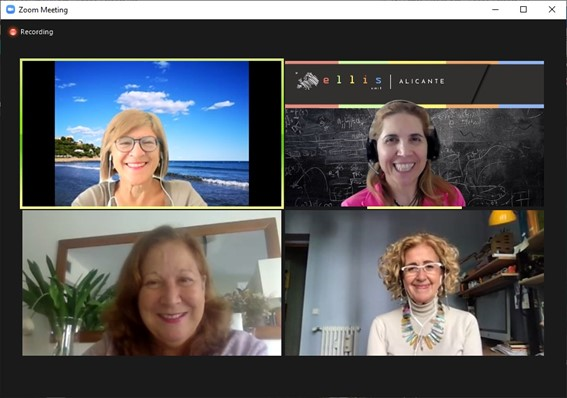

## **Quiénes**

**Cuatro mujeres** (sociólogas, politólogas y tecnólogas), dos de ellas catedráticas de universidad y las cuatro muy bregadas también en el trabajo desde el terreno (**ámbitos sociales, educativos, institucionales, empresariales y tecnológicos**), hemos decidido poner nuestro grano de arena en la **reflexión sobre la crisis COVID-19**. Intentamos aportar, como equipo que piensa conjuntamente, miradas y propuestas que nos parecen poco representadas en el debate público. No solo por el hecho de ser mujeres comprometidas con la **igualdad de género** (en ese sentido, nuestro objetivo no es el de encasillarnos en las problemáticas u ópticas femeninas, aunque por supuesto las abordemos: queremos reflexionar sobre el conjunto), sino porque apreciamos que al debate en curso le faltan también perspectivas más diversas, integradoras y pluridisciplinares. Perspectivas que puedan incidir tanto en la creación de opinión como en el diseño y materialización de las nuevas políticas públicas en curso, con la vista puesta -sobre todo- en la **agenda europea 2021-2027** y su traslación a España.

**Somos**, por orden alfabético:

**Cecilia Castaño**, Doctora en Ciencias Políticas, Catedrática en Economía Aplicada en la Universidad Complutense de Madrid, *Visiting Research Fellow* en Massachusetts Institute of Technology (MIT), Harvard University y University of California Berkeley y Experta en Género en los ámbitos de las tecnologías de la información (TIC) y de la ciencia, la ingeniería y la tecnología (STEM).

**Capitolina Díaz**, Doctora en Sociología por la Universidad de Londres, Catedrática en el Departamento de Sociología y Antropología Social de la Universidad de Valencia, ex Directora General de Igualdad en el Empleo y ex Presidenta de la Asociación de Mujeres Investigadoras y Tecnólogas (AMIT).

**Nuria Oliver**, Doctora en Inteligencia Artificial por el Massachusetts Institute of Technology (MIT), Chief Data Scientist en Data-Pop Alliance, Chief Scientific Advisor para el Vodafone Institute y co-fundadora y vice-presidenta de ELLIS (European Laboratory for Learning and Intelligent Systems). Desde Marzo 2020, es Comisionada para Presidencia de la Generalitat Valenciana en Inteligencia Artificial y Ciencias de Datos en la lucha contra COVID-19. 

**María Ángeles Sallé**, Doctora en Ciencias Sociales por la Universidad de Valencia; especialista en el impulso, planificación, gestión integral y evaluación de políticas e iniciativas de desarrollo y cambio socioeconómico y tecnológico, en España y Latinoamérica; empresaria durante más de 20 años y ex directora del Observatorio Nacional de Telecomunicaciones y Sociedad de la Información (ONTSI).

## **Qué**

Hemos escrito para EL PAIS una serie de **cinco artículos, de firma conjunta,** que pretenden exponer determinados impactos socioeconómicos de la pandemia que estimamos relevantes pero poco visibilizados, junto al lanzamiento de algunas ideas y propuestas que contribuyan a un mejor abordaje de los mismos.

Los tres primeros (“verticales”) se enfocan en **colectivos** que constituyen la columna vertebral de nuestras sociedades, pero cuya voz se está viendo escasamente representada: **trabajadores/as pobres, jóvenes y mujeres**. Mientras que los dos últimos (“horizontales”) ponen el énfasis en dos grandes **palancas de cambio**, que tienen que ir de la mano a la hora de enfrentar los desafíos de la humanidad en un momento tan decisivo como el actual: **la tecnología y los datos digitales con enfoque humano-céntrico y ligado a la sostenibilidad ambiental,** uno de ellos, y **la capacidad de agencia efectiva de las personas en un mundo disruptivo e incierto**, el último artículo. La adopción real de estas palancas de cambio implicaría, en buena medida, una transformación revolucionaria en la configuración del pensamiento y la acción social.

Son los siguientes artículos: 

1. Nueva crisis, viejas desigualdades. 

2. [“Pandemials”: ¿culpables o ignorados?](https://ellisalicante.org/es/pandemials.es.md) Publicado en [EL PAIS el 18-nov-2020](https://elpais.com/opinion/2020-11-17/los-pandemials-culpables-o-ignorados.html)

3. Mujeres en al primera y segunda ola: más contribución y menos igualdad.

4. Datos digitales y tecnología para un mundo mejor. 

5. “Personas en el centro”: pensar al revés las nuevas agendas del cambio social.