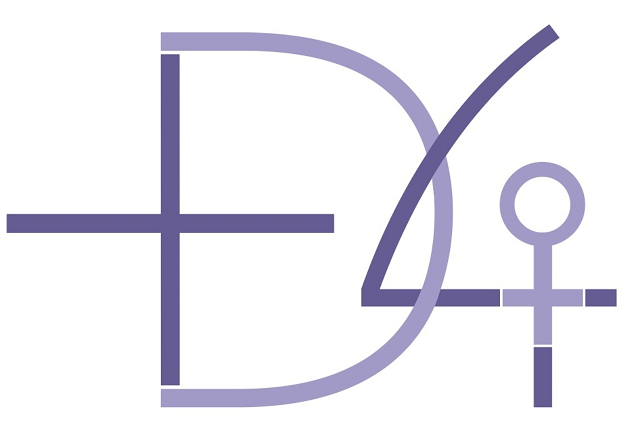

## **Los ‘pandemials’, ¿culpables o ignorados?**

**María Ángeles Sallé**, **[Nuria Oliver](https://nuriaoliver.com),** **Cecilia Castaño** y **Capitolina Díaz** 

Artículo publicado por EL PAIS el 18 NOV 2020 (https://elpais.com/hemeroteca/2020-11-18/)

No podemos sostener el reproche de los adultos hacia los jóvenes. En realidad, parten con desventaja ante un difícil mercado laboral y corremos el riesgo de romper la solidaridad intergeneracional. <!--more-->

La juventud ha adquirido en la segunda ola de la pandemia una gran visibilidad. Pero es una visibilidad centrada en su rol negativo como esparcidores del virus, ya sea debido a su naturaleza física o al comportamiento que habitualmente se les atribuye (irresponsabilidad, egoísmo, botellones sin mascarillas, resistencia a la autoridad, inconsciencia, rebeldía). Más allá de las escenas de unos cuantos irresponsables, proponemos una mirada más amplia mediante un repaso a dos dimensiones (comportamientos e impacto de la pandemia) que apelan a la urgente puesta en marcha de nuevos abordajes.

En relación con los comportamientos, recordemos que la juventud es la etapa en la que las relaciones se convierten en el centro de la vida, más aún en los sociables países del sur. Así, mientras que la cuarta parte de los españoles se relaciona diariamente con sus amistades (frente al 15% en la Europa comunitaria), entre los jóvenes esa frecuencia alcanza el 58% (89% al sumar la frecuencia semanal). Si a ello añadimos tres meses de confinamiento estricto, tenemos la mesa servida. No podemos por tanto demonizar ahora a unos jóvenes a los que, al igual que al resto de colectivos, se animó a salir a poblar carreteras, playas, bares y discotecas. Chicas y chicos que por cierto, según la encuesta ciudadana [COVID19ImpactSurvey](https://covid19impactsurvey.org), reportan [niveles similares](https://ellisalicante.org/es/covid19impactsurvey) a otros grupos de edad en el uso de mascarillas y desinfección de manos, si bien muestran niveles significativamente inferiores en las medidas de distanciamiento físico. No hay que olvidar que la propensión al riesgo es más habitual en las edades jóvenes que en las maduras, como ilustran las estadísticas de accidentes de tráfico, abuso de drogas, enfermedades de transmisión sexual o embarazos no deseados. Tampoco podemos dejar de reconocer la respuesta que ha dado tanta juventud anónima a los problemas de la pandemia a través de su ejercicio profesional, actividades de voluntariado, solidaridad vecinal y soluciones tecnológicas.

En referencia a los impactos, los efectos de la pandemia sobre nuestra población más joven son y serán tan catastróficos como desproporcionados, empezando por las débiles condiciones de partida en las que el virus les encontró después de haber sido las principales víctimas silenciosas de la crisis de 2008. En el plano laboral, los menores de 30 años constituyen apenas 15 de cada 100 activos, pero ascienden al 21% de los trabajadores a tiempo parcial, el 30% de los desocupados (así como el 80% de quienes buscan su primer trabajo) y el 30% de los trabajadores temporales, con una tasa de temporalidad que afecta a la mitad de la ocupación juvenil, en un país que ya de por sí duplica el índice de la UE. No es de extrañar en esa medida que los jóvenes de entre 16 y 24 años ocupen el primer lugar en la tasa de riesgo de pobreza (30,5% después de transferencias sociales frente a un 14,8% de los mayores de 65 años), que más de un tercio tengan dificultades para llegar a fin de mes, la quinta parte tengan carencias materiales (frente al 10% de los mayores de 65) y el 41,4% no puedan hacer frente a gastos imprevistos. En tal situación es casi un milagro acceder al alquiler o compra de una vivienda, lo que retrasa la edad de emancipación y explica, al menos en parte, que más de tres cuartas partes de los españoles menores de 30 (frente a la mitad de los europeos) no se hayan independizado. Fenómeno que profundiza una infantilización de consecuencias nefastas para la sociedad, la economía, sus propias vidas y las de sus familias.

Quienes sí lo han logrado se ven más frecuentemente afectados por la falta de espacio (8,7% frente al 1,7% de los mayores de 65 años), deficiencias en la vivienda (19,6% frente al 13,5%) y un fuerte agujero en sus rentas, al dedicar a esta más del 30% de su presupuesto (el doble que el total de la población). Tampoco ayudan los indicadores educativos, pese a la mejora experimentada en los últimos años, al situarse España en los puestos de cabeza entre los países europeos con mayor infracualificación juvenil, abandono escolar o proporción de jóvenes que ni estudian ni trabajan. Una juventud, por último, que en plena era de la cuarta revolución industrial se plantea (cuatro de cada 10) dedicarse a trabajos que corren el riesgo de ser automatizados y desaparecer en los próximos 10 o 15 años.

De este modo, los jóvenes españoles han partido de una posición socioeconómica mucho peor para enfrentar la pandemia que el conjunto de la población, salvo en algunos indicadores de salud, a lo que se añade el escasísimo peso en la agenda y gasto público que tradicionalmente han tenido en España las políticas públicas de juventud.

En este contexto, la afectación de la pandemia en los jóvenes está siendo bastante más dura que lo que las apariencias hacen suponer. El cierre de centros educativos ha tenido, por ejemplo, una repercusión directa en los planes de vida y aprendizaje de muchos jóvenes de nuestro país. Pero la vulnerabilidad mayor es la que se está dando en relación al empleo, con un incremento de la tasa de paro que duplica a la de los grupos de mayor edad, una disminución mucho más acusada de la tasa de afiliación a la seguridad social y el hecho de que el 41% de los jóvenes protegidos por los ERTE —frente al 29% de sus restantes beneficiarios— están corriendo un grave riesgo de quedar desempleados a su finalización, al concentrarse en empleos precarios y situarse en sectores laborales no esenciales. Se identifica también una fuerte tendencia al alza, tras un notable descenso, del número de *ninis* en España. Por su parte, para muchos jóvenes recién graduados (sobre todo mujeres) la pandemia está cercenando sus oportunidades de ingresar en el mercado laboral y, quienes lo acaban de hacer, tienen un gran temor a situarse en la lanzadera de los despidos o de la estigmatización, más todavía si resultan contagiados por el virus, lo que probablemente pudiera hasta incidir en el ocultamiento de casos asintomáticos o leves. Al mismo tiempo, no tener vivienda o tenerla muy pequeña y en malas condiciones se convierte en una pesadilla si toca hacer cuarentena, realidad que se constata en los motivos declarados por los menores de 30 años para no poder realizarla respecto a los mayores de esa edad, segun la encuesta ciudadana [COVID19impactsurvey](https://covid19impactsurvey.org): [comparten el hogar](https://ellisalicante.org/es/covid19impactsurvey) (34% frente al 26%), miedo a la estigmatización (16% frente al 4,5%), imposibilidad económica (12% frente al 7%) o miedo a perder el trabajo (9% frente al 5%). ¿Y los procesos de emancipación juvenil? Con casi total seguridad, se verán ralentizados o incluso revertidos, con un fuerte coste para ellas/ellos y para las familias.

La pandemia, pues, tiene un gran impacto en la juventud española, que agrava una mala situación preexistente añadiéndole nuevas barreras, tales como la reducción de la movilidad y de las relaciones sociales, la afectación diferencial de la crisis económica, la ralentización de los proyectos educativos, la estigmatización social y, también, el soportar [costes emocionales](https://ellisalicante.org/es/covid19impactsurvey) muy superiores a los de los colectivos de mayor edad en campos como la ansiedad, el estrés, la tristeza, el abuso de la tecnología, la soledad y las discusiones en el hogar. Otros estudios globales corroboran el crecimiento entre los jóvenes, sobre todo entre las chicas, de la ansiedad y la depresión.

Frente a todo ello, hace falta un cambio urgente de perspectiva y nuevas políticas que rompan el actual y peligroso cruce de culpas entre generaciones. No podemos frivolizar el riesgo, cada vez más real, de que la pandemia nos aboque a la ruptura de la solidaridad intergeneracional en España. Ni tampoco sirve de nada recurrir al reproche constante desde nuestra vieja colina adulto-céntrica, cada vez más carente de empatía. En nuestra opinión, es el momento de aplicar estrategias diferenciadas con enfoque generacional que incorporen acciones de sensibilización y acompañamiento diseñadas desde su marco mental, lenguajes y soportes; que integren mejor sus necesidades en las intervenciones destinadas a paliar los efectos inmediatos de la pandemia y que desarrollen medidas socioeconómicas a favor de las y los jóvenes en el marco de los planes de reconstrucción que se están actualmente gestando, con fondos nacionales y europeos. Todo ello contando activamente con la juventud, no solo como objeto sino, sobre todo, como sujeto protagonista. Porque, no nos engañemos, en el proceso de escuchar, involucrar y articular la voz olvidada de la juventud es donde verdaderamente nos jugamos el porvenir: sin juventud, empoderada e involucrada, no hay futuro ni esperanza. Y sería justo que, quienes van a tener que pagar la impresionante hipoteca adquirida para solucionar la crisis que ha traído la pandemia, también participen en la solución.

Este es el primero de una serie de artículos sobre las consecuencias de la pandemia desde ópticas multidisciplinares elaborados por: **María Ángeles Sallé** es doctora en Ciencias Sociales por la Universidad de Valencia. **Cecilia Castaño** es catedrática en Economía Aplicada en la Complutense de Madrid. **Capitolina Díaz** es catedrática de Sociología en la Universidad de Valencia. Y **Nuria Oliver** es doctora en Inteligencia Artificial por el MIT, co-fundadora y vice-presidenta de [ELLIS](https://ellis.eu).