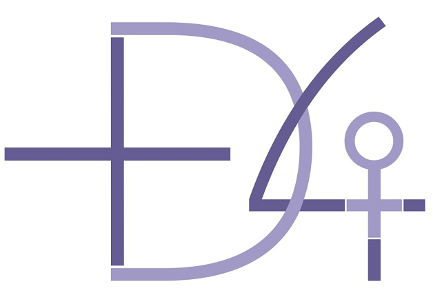

## **"Las personas en el centro": Una vuelta a las agendas del cambio social**

**María Ángeles Sallé**, **Cecilia Castaño**, **Capitolina Díaz** y **[Nuria Oliver](https://nuriaoliver.com),**  

Artículo publicado por [EL PAIS, el 17 Diciembre 2020](https://elpais.com/opinion/2020-12-16/las-personas-en-el-centro-una-vuelta-a-las-agendas-del-cambio-social.html) 

El papel del Estado es hoy más indispensable que nunca para la ciudadanía, y poner de verdad el foco
en ella solo será posible si el Estado se compromete en el proceso de transformarse a sí mismo <!--more-->

“Las personas en el centro”, un mantra que corre el riesgo de banalizarse si no se convierte en el núcleo de las agendas del cambio para abordar los [Objetivos de Desarrollo Sostenible 2030](https://elpais.com/especiales/2015/planeta-futuro/objetivos-desarrollo-sostenible/), la transformación socioeconómica, verde y digital de Europa, así como de la respuesta frente a la pandemia global de COVID-19.

Impulso del talento, creatividad, digitalización, igualdad, emprendimiento, resiliencia, empleabilidad, diversidad… con el cambio cultural como broche de oro, son términos que definen sin excepción procesos humanos, y cualquier foro que se precie está plagado de ellos. Pero antes de avanzar en el diseño del alud de medidas transformadoras (y autotransformadoras) necesarias para enfrentar los retos que tenemos por delante, es necesario reflexionar y poner en común la visión que unos y otras tenemos sobre lo que se cuece tras este objetivo crucial del que sabemos bastante poco.

El primer Informe sobre el Desarrollo Humano de Naciones Unidas (1990) nos daba las primeras pistas al señalar que “el objetivo principal del desarrollo es ampliar las opciones de las personas”, basándose en la teoría de Amartya Sen y Martha Nussbaum sobre la expansión de las capacidades humanas de las que cada persona dispondría para alcanzar aquello que valora. Particularmente la capacidad de agencia, esto es, de participar activamente en las decisiones económicas, sociales y políticas.

Es abundante la literatura en la que se ha conceptualizado esta perspectiva del desarrollo centrada en lograr vidas vivibles en un planeta sostenible, pero la realidad es que hoy seguimos muy lejos de abordar el cambio de ética social y cultura política que ello requiere. La crisis actual, sin embargo, nos abre la oportunidad de afrontar este reto impostergable, que debiera comenzar realizando una revisión crítica de muchas ideas y prácticas arraigadas.

Poner a las personas en el centro implica reconocer nuestra diversidad y evitar que las políticas
se construyan en torno a seres supuestamente homogéneos cuyas realidades se desconocen. 

Empecemos por [la utilización del PIB](https://elpais.com/economia/2020-12-11/la-tasa-de-deuda-crece-al-ritmo-mas-rapido-desde-los-anos-cuarenta.html) como indicador preferente para medir el desarrollo. Si poner en el centro a las personas significa darles protagonismo como su objeto principal, es necesario incorporar indicadores que no se fundamenten en el predominio de la producción sobre el bienestar, basados en la engañosa idea de que un aumento en la producción repercutirá automáticamente en el incremento de un bienestar concebido como subordinado al crecimiento. Lo cuantitativo vs. lo
cualitativo, mucho más inasible y difuso. Esta jerarquización de la economía sobre el bienestar muestra hasta qué punto seguimos manteniendo una interpretación dicotómica del mundo que nos aboca a una gestión excluyente de las dualidades: cuerpo-mente, naturaleza-cultura, amor-poder, pasado-futuro, intuición-razón, producción-reproducción… pero, también, individuo-comunidad, social-económico, público-privado, nosotros-los otros, tradición-innovación, local-global, ciencias-humanidades…

Esto es lo que está detrás de la lamentable disyuntiva pandémica entre salud y economía, donde el debate se plantea en términos de oposición (salud vs. economía o viceversa) o subordinación (elegir lo considerado primordial frente a lo secundario). Es verdad que en el universo y en la naturaleza humana a menudo aparecen dualidades, pero se trata de dualidades basadas en las complementariedades y la inclusión, en la conjunción copulativa “y” y no en la conjunción disyuntiva “o”. Sin embargo, en nuestro entramado socioeconómico, institucional y cultural casi todo está basado en la fragmentación de espacios separados por fronteras e islas corporativas, con un marco mental y operativo que dificulta la confluencia, el diálogo y la hibridación. La vida no funciona así, las personas no somos compartimentos estancos y no se nos puede despiezar, hemos de ser reconocidas y abordadas en nuestra integralidad.

Desde esa perspectiva, poner a las personas en el centro supone conjugar nuestro —lineal— impulso
transformador con esos otros procesos, más cadenciosos y sutiles, que constituyen el magma vital sobre el que se sustenta nuestra existencia y que está hecho de repetición y circularidad: el cuidado. En el cóctel de información y velocidad que nos habita, seguimos despreciando sistemáticamente lo cotidiano, los asuntos del día a día de los que depende nuestro bienestar, la ‘economía de la vida’, invisibilizada tras las espesas cortinas de lo privado. La pandemia nos está recordando, no obstante, que somos entes sociobiológicos y que las principales dinámicas sociales y biológicas se basan en la recurrencia. Con todo, todavía nos falta mucho para interiorizar esta gran lección de humildad.

Concebir a las personas como el núcleo del desarrollo implicaría, desde esta óptica, privilegiar las disciplinas biosanitarias y sociohumanísticas, así como a quienes las ejercen, al tratarse de las y los principales expertos en el ámbito de las personas. Ellas y ellos constituirían el principal motor del desarrollo sostenible, trabajando mano a mano, entre otros, con especialistas digitales para configurar una nueva era de humanismo tecnológico cuyo eje sea la sostenibilidad de la vida.

Poner a las personas en el centro implica también reconocer nuestra diversidad y evitar que las políticas se construyan en torno a seres supuestamente homogéneos cuyas realidades se desconocen; en torno a objetos sin sujeto (emprendimiento más que emprendedor/a; solución tecnológica en lugar de persona que se apropia de la tecnología para resolver problemas).

O todavía peor, que se piense a las personas en función de un sujeto ideal hegemónico que define una universalidad excluyente en la que no cabe la inmensa mayoría de los seres de carne y hueso: el varón blanco adulto heterosexual occidental y cosmopolita, medida de todas las cosas. Un patrón que segrega, jerarquiza y discrimina.

No hay tampoco personas en el centro sin considerar la subjetividad humana. Creamos a partir de lo que creemos y, desde ese punto de vista, mente y emociones, pensamientos y sentimientos, constituyen los principales territorios del desarrollo y el cambio social, ese inexplorado mundo interior hecho de mandatos, automatismos, convenciones y expectativas en el que se forjan buena parte de nuestros éxitos y fracasos. Se requiere, por tanto, contar con aproximaciones y equipos pluridisciplinares en los que quepan también profesionales de las neurociencias, psicología, sociología, antropología o inteligencia artificial. Lo que no puede ser es que, en plena era del macrodato, las compañías tecnológicas sean capaces de predecir y prescribir nuestro comportamiento, mientras que quienes diseñan las agendas de desarrollo humano apenas consideren las dimensiones psicoculturales en sus conceptualizaciones, iniciativas y programas. Una ignorancia de la experiencia humana que, en el caso de la pandemia, la reduce a datos de casos, hospitalizaciones, fallecidos, UCI, PIB o ERTE, eludiendo así situar también la atención en su impacto emocional y en la salud mental.

Poner a las personas en el centro significa dar prioridad a las personas como sujetos principales participantes en la toma de decisiones, y considerar su contexto social, entretejido por sistemas de poder que condicionan el acceso a las oportunidades. Implica, asimismo, revisitar la relación entre individuo y comunidad. La condición humana está forjada de autonomía y dependencia, libertad individual y solidaridad colectiva, personas que buscan espacio propio y seres interdependientes. Y el
papel del grupo, del ecosistema social, es clave. Una vez más, la pandemia nos está demostrando el valor de lo comunitario como espacio de resiliencia y cocreación de alternativas. Es necesario extender este enfoque a todas las agendas del cambio, así como potenciar el papel de las instituciones locales, las más próximas a las personas, porque es allí donde las opciones de sumar voluntades, articular necesidades y oportunidades, gestionar la diversidad, acompañar aprendizajes y cambios, pueden
gestarse y multiplicarse más fácilmente.

Si el desarrollo es cambio y el protagonismo en ambos corresponde a las personas, entonces el término clave es el de flujo o proceso. Porque los seres humanos y las organizaciones de la sociedad movilizamos nuestras energías para resolver problemas y conseguir objetivos y, para ello, trazamos caminos que nos lleven hasta donde queremos llegar. Por ello, el gran reto de cualquier estrategia de cambio social es lograr la máxima personalización y direccionamiento del esfuerzo individual, pero creando, a la par, puentes y puntos de encuentro que generen masa crítica suficiente para dar el salto de lo micro a lo macro. No podemos dar un triple salto mortal entre lo pequeño (persona, pyme, lo local) y lo grande (globalización, comunidad planetaria) si en el medio no hay nada, un hilo, una escalera, un proceso de conexiones intermedias que hoy, más que nunca, pueden estimularse y alcanzarse con estrategias, organización y metodologías innovadoras, enfocadas al sujeto y
apoyadas en recursos digitales.

Pero la realidad es que la mayoría de las actuaciones continúan fundamentándose en la noción de hito, no de proceso. Trasladamos así el modelo mecánico de intervenir sobre objetos (por ejemplo, construir una carretera o extender la fibra óptica) al hacerlo sobre los sujetos y sus mundos, un cuerpo orgánico que se mueve con reglas muy diferentes y que responde mal a fórmulas estándar. No resulta extraño, en esa medida, que las Administraciones públicas se sientan aliviadas cuando les toca gestionar una gran infraestructura (hitos concentrados en el tiempo, objetivables cuantitativamente y con un volumen importante de inversión) y vivan, por el contrario, como un quebradero de cabeza las intervenciones que involucran personas (una compleja cadena de microactuaciones que implican a muchos actores, que necesitan de constante coordinación y articulación, que caben mal en los procedimientos y que requieren de un variado elenco de competencias soft, que normalmente no se poseen). Demasiada complejidad y esfuerzo para unos resultados cuantitativos —que son los que se
miden e importan— infinitamente más modestos e invisibles que las grandes obras de inversión. Este no es un planteamiento abstracto, numerosas evaluaciones de políticas públicas (de empleo, inclusión, igualdad…) muestran obstinadamente los límites y graves insuficiencias de este modelo.

No es un problema de capacidad profesional. En el sector público hay magníficos profesionales, con un alto nivel de compromiso, experiencia y ganas de cambiar. El problema es que la institucionalidad pública lleva las dicotomías en sus genes y, en la práctica, todo su quehacer está compartimentado con rígidas fronteras temáticas, competenciales y jerárquicas. Esto dificulta tener una visión global de los procesos, pero también considerar las necesidades de cada persona.

Por tal razón, muchos esfuerzos en materia de cambio social han sucumbido a esta exigencia de compartimentación (temática, organizacional y temporal), o bien se han ido perdiendo en la ruta. El apasionante objetivo de poner a las personas en el centro es un propósito que nos compete a todas y a todos, por eso no tendrá viabilidad sin un fuerte liderazgo público. El papel del Estado es hoy más indispensable que nunca para las personas y ponerlas de verdad en el centro solo será posible si
el Estado se compromete en el proceso inaplazable de transformarse a sí mismo.

Este es el cuarto de una serie de artículos sobre las consecuencias de la pandemia desde ópticas multidisciplinares elaborados por: **María Ángeles Sallé** es doctora en Ciencias Sociales por la Universidad de Valencia. **Cecilia Castaño** es catedrática en Economía Aplicada en la Complutense de Madrid. **Capitolina Díaz** es catedrática de Sociología en la Universidad de Valencia. Y **Nuria Oliver** es doctora en Inteligencia Artificial por el MIT, co-fundadora y vice-presidenta de [ELLIS](https://ellis.eu).