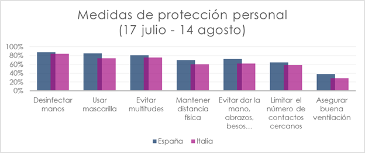
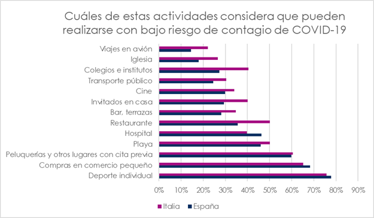
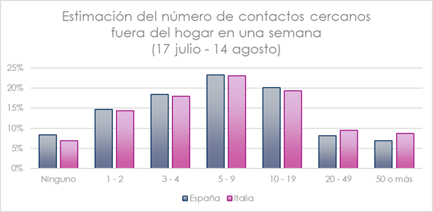
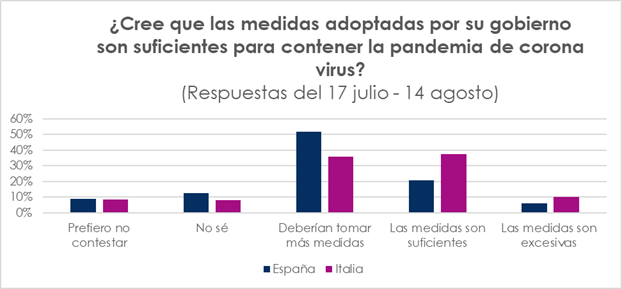
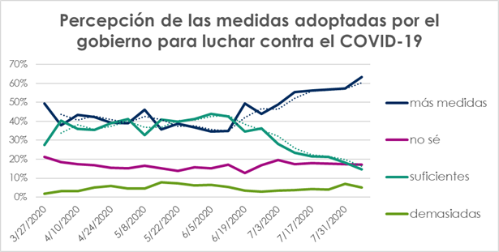
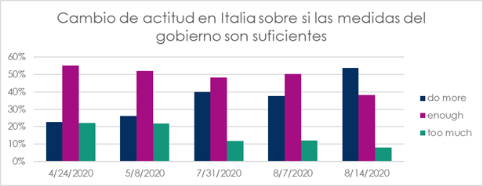
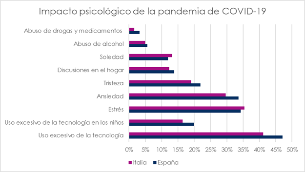
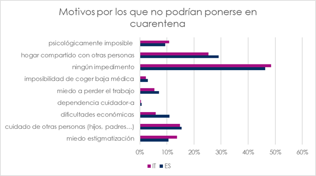
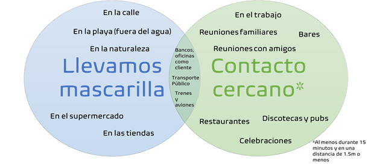

Dr. Nuria Oliver
nuria@alum.mit.edu
18 agosto 2020

España tiene ahora mismo una media de los últimos 7 días de mas de 4600 nuevos casos diarios de COVID-19, mientras que Italia tiene una media de 480 nuevos casos diarios, es decir, aproximadamente 10 veces menos que España. 

Dado el impacto similar de COVID-19 en la primera oleada, la similitud en la cultura de ambos países, y su elevada tasa de turismo, cabe preguntarse por qué Italia tiene 10 veces menos casos que España. 

Para ayudar a contestar esta pregunta, lanzamos la encuesta ciudadana [Covid19impactsurvey.org](https://covid19impactsurvey.org/) en Italia. Desde el 3 de julio, tenemos más de 5,200 respuestas de Italia. Para ese periodo, tenemos mas de 45,200 respuestas de nuestro país. 

Los gráficos incluidos en este documento representan los porcentajes de las respuestas a la encuesta ciudadana ponderados por sexo y edad. 

##### Hipótesis 1: Los italianos son más cumplidores en sus medidas de protección personal que los españoles

La primera hipótesis para explicar las diferencias entre España e Italia se corresponde a pensar que los italianos adoptan mas medidas de protección individual que los españoles. Desgraciadamente, este no es el caso, ya que para **todas las medidas de protección individual,** los españoles son más cumplidores que los italianos. 

Asimismo, un mayor porcentaje de italianos considera que ir a la playa, restaurantes, bares y terrazas, cine, transporte público, colegios-institutos, iglesia, viajar en avión y tener invitados en casa pueden realizarse con bajo riesgo de contagio de COVID-19, en comparación a España: 

 

#### Hipótesis 2: Los italianos tienen menos contactos cercanos que los españoles 

No se observan diferencias significativas en el numero de contactos cercanos fuera del hogar entre España e Italia. 

#### Hipótesis 3: Los italianos consideran que las medidas de sus gobiernos son suficientes y los españoles no

Esta hipótesis se ve confirmada con los datos de la encuesta. Efectivamente, hasta el 14 de agosto, la respuesta más popular en Italia con respecto a la valoración de las medidas del gobierno para combatir el COVID-19 es que las medidas eran suficientes. Sin embargo, en España, la respuesta más popular es que deberían adoptarse más medidas. 

En España, se produjo un **cambio significativo** en la valoración de las medidas cuando comenzó la nueva normalidad, como refleja el gráfico de abajo

Curiosamente, observamos un **cambio significativo** en la percepción de las medidas del gobierno en Italia a partir de esta semana, donde por primera vez observamos que la respuesta mayoritaria en Italia es que el gobierno debería hacer mas 

#### Hipótesis 4: El impacto psicológico de la pandemia ha sido superior en Italia que en España y por ello hay un mayor cumplimiento de las medidas 

No observamos diferencias significativas del impacto psicológico de la pandemia entre España e Italia

####  **Hipótesis 5: Un porcentaje superior de personas en Italia pueden hacer una cuarentena efectiva que en España**

No observamos una diferencia significativa entre los dos países. En ambos, mas de un 50% de los encuestados reportan **no poderse poner en cuarentena** de manera efectiva 

 

#### **Hipótesis 6: España hace muchos mas tests que Italia y por eso hay detecta mas casos** 

Tanto en España como en Italia, un 1% de los encuestados reportan que su medico les ha recomendado el test pero no hay disponibilidad; un 43% en España y un 33% en Italia reportan que no se han hecho el test, pero les gustaría hacérselo. Según *Our World in Data*, España efectivamente hace más del doble de tests diarios por cada 1000 habitantes en comparación a Italia (0.4 en Italia vs ~1 en España). Pero si miramos el ratio entre los tests diarios y los nuevos casos diarios confirmados, encontramos que Italia tiene un 2% de tasa positiva frente a un ~9% en España. Cuanto más pequeño sea este %, mejor, ya que quiere decir que se hacen muchos mas tests por cada caso positivo. España esta situada entre los países con la tasa más elevada de Europa junto a Croacia. 

**Hipótesis 7: En Italia hay mas teletrabajo que en España** 

Según la encuesta ciudadana, en el ultimo mes un 7% de los encuestados tanto en España como en Italia reportan tele-trabajar 

En base a los datos oficiales y a los datos de la encuesta ciudadana, es evidente que la prevalencia de COVID-19 en España es muy superior a Italia.

## ¿Que hemos hecho para estar aquí, dadas las gráficas anteriores? 

####  **Hipótesis 1: El trazado de contactos esta fallando** 

Según la encuesta ciudadana, un 80% de los encuestados que reportan haber estado en contacto cercano con una persona infectada de COVID-19, reportan que no les han contactado para preguntar por sus contactos. 

Si miramos a los casos positivos (que es un numero muy bajo), vemos que un 45% de este grupo reporta que no les han llamado para hacerles el trazado o no han llamado a sus contactos. 

#### **Hipótesis 2: Diferencias en el uso de mascarillas** 

En España el uso de mascarillas en exteriores es evidente, pero una hipótesis es que dicho uso se relaja mucho mas cuando nos encontramos en interiores: restaurantes, pubs, hogares, etc… En Italia, hablando con los investigadores, parece que el uso en interior de la mascarilla esta mas controlado que en exteriores 

#### **Hipótesis 3: Diferencias en el ocio nocturno**

Un elevado %% de brotes en España son debidos al ocio nocturno. En Italia han sido mucho mas cautelosos con el ocio nocturno que no ha estado permitido. Para compensar al sector, han aprobado paquetes económicos. 

#### **Hipótesis 4: El impacto del turismo y los viajeros** 

España tiene un elevado %% de turistas británicos y el Reino Unido fue el país europeo más atrasado con respecto a la evolución de la pandemia. Cabe pensar que algunos brotes puedan ser debidos a la diferencia del turismo, así como de personas locales que regresan después de un viaje. En Italia parece que hay mas controles hacia los turistas y las personas que regresan de viajes 

#### **Hipótesis 5: Medidas de seguridad/protección en el entorno laboral**  

Puede haber diferencias significativas en el cumplimiento de medidas de protección en las empresas y lugares de trabajo, sobre todo aquellos con alta probabilidad de brotes como los jornaleros, las plantaciones agrícolas, las plantas de procesamiento de carne, los centros de logística, etc… 

#### **Hipótesis 6: Tiempo de reacción en la gestión de los brotes** 

Seria interesante estudiar las diferencias en el tiempo de reacción ante los brotes en un país y otro. Conversaciones con investigadores italianos revelan una percepción de una gestión eficiente y rápida de los brotes que han surgido en el país 

#### **Hipótesis 7: Impacto de las celebraciones y reuniones familiares** 

Otra área para investigar es la gestión en Italia de las reuniones familiares y celebraciones frente a España 

#### **Hipótesis 8: En España hay mas movilidad que en Italia** 

Esta hipótesis podría corroborarse -o no- con datos de movilidad de la red de telefonía móvil o datos oficiales de transporte 